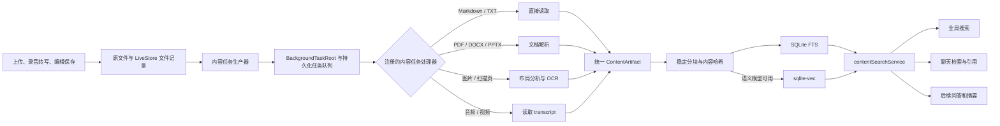

# 文档解析、图片 OCR 与检索索引接入方案

- **Status**: Proposed
- **Branch**: `codex/playground-content-pipeline-plan`
- **Scope**: `@memora/web`
- **Target**: 将 playground 中已验证的文档解析、图片 OCR 和本地混合检索能力接入文件上传、编辑、全局搜索与聊天引用流程

## 结论

建议把当前能力拆成四层：格式解析器、统一内容产物、通用后台任务队列、检索消费者。文件上传仍只负责可靠地保存原文件并提交 `fileCreated`；内容任务生产器观察文件变化并向统一队列提交任务，注册处理器按格式生成内容产物，再写入本地 FTS/向量索引。全局搜索和聊天通过同一个 `contentSearchService` 读取索引，playground 改为调用正式模块并继续承担诊断和基准测试用途。

第一阶段应保证所有可提取内容都能进入 FTS，不应因为语义模型尚未下载而阻塞全文检索。BGE-M3 适合中英文混合内容，但模型体积较大，因此语义索引应在用户启用并完成模型下载后补建；未启用时继续使用 SQLite FTS。已有 `autoIndex` 控制自动解析和全文索引，另加一个独立的语义检索开关。

## 当前链路与缺口

### 文件进入业务后停在 `pending`

`packages/web/src/components/desktop/DesktopPage.tsx:61-104` 在上传时将原文件写入 OPFS，并提交 `fileCreated`。`packages/web/src/livestore/file.ts:95-103` 已定义 `indexedAt`、`indexStatus` 和 `indexSummary`，默认状态是 `pending`；`packages/web/src/livestore/setting.ts:24-31` 也已默认启用 `autoIndex`。目前没有根级服务消费这些状态，因此上传后的 PDF、DOCX、PPTX 和图片不会自动解析或建索引。

编辑器保存 Markdown/TXT 时会更新原文件和 `updatedAt`，录音完成后会提交 `fileTranscribed`。这两个入口同样没有触发内容重建。

### playground 已有可复用能力

| 能力        | 当前实现                                                        | 可直接保留的行为                                                          | 接入前需要调整                                            |
| ----------- | --------------------------------------------------------------- | ------------------------------------------------------------------------- | --------------------------------------------------------- |
| PDF         | `src/lib/playground/documentParsing.ts`                         | 逐页提取 text layer；可用文字少于阈值时将页面渲染后走 OCR                 | 输出统一 segment；支持取消、页级失败和大文件限制          |
| DOCX        | 同上                                                            | Mammoth 生成安全 HTML/纯文本；docx-preview 结构可转换 Markdown 和公式     | 明确以 Markdown 结构产物为索引源，HTML 只用于预览         |
| PPTX        | 同上                                                            | 提取幻灯片文字、备注、评论、图片和 Markdown                               | 将 slide locator 写入产物；嵌入图片 OCR 改为可配置策略    |
| 图片/扫描页 | `src/lib/playground/imageDocumentPipeline.ts`                   | PP-DocLayoutV3 布局检测、PP-OCRv6、Texo 公式识别、按阅读顺序合成 Markdown | 从 React 状态中抽离生命周期；增加取消、资源预算和失败降级 |
| 嵌入        | `src/lib/playground/bgeEmbeddingClient.ts`                      | 通过共享模型 worker 批量生成 BGE 向量                                     | 支持后台优先级和 AbortSignal                              |
| 本地索引    | `src/lib/vector-db/*`、`src/workers/vector-db.shared-worker.ts` | OPFS SQLite 快照、FTS、sqlite-vec、RRF、断点续建                          | 允许先写 FTS 后补向量；增加删除文档和 locator 元数据      |

### 索引编排仍属于页面逻辑

`packages/web/src/components/playground/GroundedRetrieval.tsx:453-568` 在 React 组件内完成文档指纹检查、分块哈希、批量嵌入、断点恢复和 finalize。这个流程已经证明索引底层可用，但无法被上传、编辑、删除和聊天入口稳定复用。

### 全局搜索还没有查询正文

`packages/web/src/lib/search/searchItems.ts:74-115` 只将文件名、类型、路径和 `indexSummary` 放入同步搜索项。`packages/web/src/components/search/searchPalette/useSearchResults.ts:31-49` 只对这些内存项排序。向量数据库中的正文 chunk 尚未进入全局搜索。

聊天的 `grep_files` 直接搜索 OPFS 原文件；它适用于 Markdown/TXT 和 transcript，不适用于 PDF、DOCX、PPTX 或图片。playground 的 grounded retrieval 目前只处理带时间戳的 transcript。

## 目标流程



## 统一内容产物

解析器不应直接生成向量数据库行。所有格式先产出同一种可版本化结构，建议新增 `packages/web/src/lib/content/types.ts`：

```ts
export interface ContentArtifact {
  schemaVersion: 1;
  fileId: string;
  sourceRevision: string;
  parser: {
    name: string;
    version: string;
  };
  title: string;
  markdown: string;
  plainText: string;
  segments: ContentSegment[];
  warnings: ContentWarning[];
  createdAt: number;
}

export interface ContentSegment {
  id: string;
  kind: "title" | "text" | "formula" | "table" | "image" | "transcript";
  text: string;
  markdown?: string;
  headingPath: string[];
  locator: ContentLocator;
  searchable: boolean;
}

export type ContentLocator =
  | { kind: "text"; startOffset: number; endOffset: number }
  | { kind: "page"; pageNumber: number; rect?: PixelRect }
  | { kind: "slide"; slideNumber: number }
  | { kind: "image"; rect?: PixelRect }
  | { kind: "transcript"; startSeconds: number; endSeconds: number };
```

`sourceRevision` 由原文件内容哈希、transcript 内容哈希、解析器版本和影响结果的配置共同计算。只比较 `updatedAt` 不足以避免重复处理，也无法识别解析器升级后的重建需求。

产物保存在原文件目录中：

```text
/files/<fileId>/<fileId>.content.json
/files/<fileId>/<fileId>.content.md
```

JSON 用于结构化 locator、警告和重新分块；Markdown 用于预览、导出和聊天按范围读取。原文件始终保留，派生产物可安全重建。

### 格式路由

| 文件类型       | 内容来源                                               | locator                           | 降级行为                                                      |
| -------------- | ------------------------------------------------------ | --------------------------------- | ------------------------------------------------------------- |
| Markdown / TXT | 直接读取 UTF-8                                         | 字符范围与标题路径                | 解码失败时标记失败，不修改原文件                              |
| PDF            | 逐页 text layer；扫描页走图片 OCR                      | 页码，OCR 块可附 rect             | 某页 OCR 失败时保留其他页面并记录页级警告                     |
| DOCX           | docx-preview Markdown 结构为主，Mammoth 纯文本作为兜底 | 段落顺序；第一版可使用文本 offset | 结构解析失败时仍索引 Mammoth 纯文本                           |
| PPTX           | 幻灯片文字、备注、评论                                 | slide number                      | 图片 OCR 默认只处理没有可用文本的 slide，避免无边界的处理时长 |
| 图片           | 布局、OCR、公式组合后的 blocks                         | rect                              | 布局模型失败时退化为整图 OCR；公式失败时保留占位和警告        |
| 音频 / 视频    | transcript JSON                                        | 时间范围                          | transcript 尚未生成时保持 `pending`，不记为失败               |

表格和图片区域在没有可靠识别结果时继续使用明确的占位信息，不生成猜测文本。索引时只写入 `searchable: true` 且有有效文字的 segment。

## 统一后台任务队列

新增通用的 `BackgroundTaskRoot` 和 `backgroundTaskQueue`，挂在 `ModelWorkerRoot` 内并位于 LiveStore Provider 下。根组件只负责启动、停止队列执行器并向 React 暴露状态；任务持久化、去重、调度、重试和取消都由无 UI 的队列服务处理。

内容处理只是队列的第一组任务。后续工作区导入、缩略图生成、存储清理或批量迁移也可以注册任务处理器，不再各自创建根组件和内存队列。内容模块只保留两类职责：观察文件领域事件并提交任务，以及实现内容任务处理器。

### 队列边界

通用队列负责编排可以跨页面、跨刷新继续执行的业务任务；现有 `createLocalModelTaskQueue` 继续负责 SharedWorker 内部的模型请求调度。内容任务需要 OCR 或 embedding 时调用模型 worker，两个队列保持上下层关系，避免让通用队列感知具体模型协议。

建议的最小接口：

```ts
export interface BackgroundTask<TPayload = unknown> {
  id: string;
  kind: string;
  payload: TPayload;
  dedupeKey: string;
  priority: "user" | "background";
  resourceGroup: string;
  state: "queued" | "running" | "waiting" | "succeeded" | "failed" | "cancelled";
  attempt: number;
  maxAttempts: number;
  runAfter: number;
  dependsOn: string[];
  createdAt: number;
  updatedAt: number;
}

export interface BackgroundTaskHandler<TPayload> {
  kind: string;
  run(payload: TPayload, context: BackgroundTaskContext): Promise<void>;
}
```

第一批内容任务类型：

| 任务类型                 | 作用                                         | 去重键                                               | 依赖                         |
| ------------------------ | -------------------------------------------- | ---------------------------------------------------- | ---------------------------- |
| `content.extract`        | 读取原文件，解析或 OCR，写入 ContentArtifact | `extract:<fileId>:<sourceRevision>`                  | 无                           |
| `content.index.lexical`  | 分块并写入 SQLite FTS                        | `lexical:<fileId>:<contentHash>:<chunkerVersion>`    | 对应的 extract               |
| `content.index.semantic` | 为已存在的 chunk 补建向量                    | `semantic:<fileId>:<contentHash>:<embeddingProfile>` | 对应的 lexical、语义模型可用 |
| `content.delete`         | 取消该文件的旧任务，删除 artifact 与索引行   | `delete:<fileId>`                                    | 无，且优先于同文件其他任务   |
| `content.reconcile`      | 启动时扫描已有文件、过期产物和孤儿索引       | `reconcile:<workspaceId>:<pipelineVersion>`          | 无                           |

队列任务只保存可序列化的小型 payload，例如 file ID、source revision 和配置版本。原文件、ContentArtifact、chunk 和 embedding 不放入队列记录，处理器按需从 OPFS 或索引中读取，避免持久化重复的大块数据。

任务链按实际产物逐步生成：`content.extract` 成功写入 artifact 后，使用得到的 content hash 提交 `content.index.lexical`；lexical 完成后，只有语义检索已启用时才提交 `content.index.semantic`。这样下游去重键不依赖尚未产生的数据，失败重试也能从最近的稳定产物继续。`dependsOn` 用于记录链路、级联取消和展示，不要求调用方在任务开始前一次性构造完整 DAG。

### 持久化与状态来源

队列记录和有限长度的执行历史保存在 OPFS 的 `/background-tasks/` 下。所有标签页都可以提交任务；每次存储变更使用短时的 `memora-background-task-storage:<workspaceId>` lock，执行器使用独立的 leader lock，避免长时间阻塞任务提交。状态变化通过 `BroadcastChannel` 通知其他标签页和 UI。应用启动后，执行器把遗留的 `running` 任务恢复为 `queued`，再根据 `runAfter`、依赖状态和资源组继续执行。

可重试错误使用 5 秒、30 秒、5 分钟的退避时间，默认最多自动执行 3 次；`waiting` 不消耗重试次数。用户手动重试会创建或恢复一项 `user` 优先级任务。成功、取消和最终失败的记录只保留最近 7 天或 500 条，防止队列历史无限增长。

队列是执行状态的来源。文件表继续保存 `contentPath`、`contentHash`、`contentVersion`、`indexStatus`、`indexedAt` 和 `indexSummary` 等业务结果；“正在解析”“正在分块”“等待模型”“第几次重试”等过程信息从关联任务投影到 UI，不在文件表中重复维护完整任务状态。建议增加 `fileContentPrepared` 和 `fileProcessingFailed` 事件，`fileIndexed` 只在 lexical finalize 成功后提交。

需要展示的任务错误使用结构化字段：

```ts
export interface BackgroundTaskError {
  code: string;
  message: string;
  retryable: boolean;
  detail?: string;
}
```

### 触发条件

- 新文件提交 `fileCreated` 且 `autoIndex` 为 `true` 时，任务生产器提交 `content.extract`。
- Markdown/TXT 编辑器提交会改变内容的 `fileUpdated`。任务生产器对连续自动保存增加约 1.5 秒静默期，只提交最新 revision。
- 音频或视频提交 `fileTranscribed` 后，提交使用 transcript revision 的 `content.extract`。
- 用户点击“重新处理”时，以 `user` 优先级提交新的任务链。
- `BackgroundTaskRoot` 启动后提交一次 `content.reconcile`，恢复中断任务并发现 parser/index 版本过期的文件。

文件重命名、移动文件夹、改变桌面坐标不应触发重新解析。标题或路径需要更新时，只更新检索展示元数据。

### 文件业务状态

继续保留现有 `indexStatus: pending | processing | indexed | failed` 作为列表和搜索入口使用的概要状态，并增加内容产物字段：

```ts
contentPath: string | null;
contentHash: string | null;
contentVersion: string | null;
```

解析产物已经成功但 lexical 或 embedding 任务失败时，保留 `contentPath` 和 `contentHash`。重试只重新提交失败阶段及其后续任务，不重复 OCR。

模型尚未下载、transcript 尚未生成、页面暂时不可解码属于可恢复等待状态，对应任务进入 `waiting` 并设置下一次检查时间。解析器抛出确定性错误、产物无法写入或多次重试后仍失败才将文件概要状态写为 `failed`。

### 并发、取消和多标签页

- 队列按资源组限制并发：`document-parser` 为 1，`local-model` 为 1，`io` 初始为 2；嵌入批次沿用 12 个 chunk，每批之间让出事件循环。
- 自动任务使用 `background` 优先级；用户手动重试使用 `user` 优先级。进入模型 worker 后仍映射为现有 `background` 或 `interactive` 优先级，让聊天和 ASR 可以先执行。
- 每个运行任务持有 AbortController。文件被删除、内容再次保存、`autoIndex` 被关闭时，队列按 file ID 与 revision 取消或取代旧任务。
- 相同 `dedupeKey` 只保留一项；同一文件的新 source revision 会取消尚未开始的旧 revision 任务，运行中的任务在安全点终止。
- 依赖失败时，下游任务进入 `waiting` 或 `cancelled`，不得继续使用不完整的 artifact。
- 写入产物和提交状态前重新读取当前 file revision；旧任务不得覆盖新内容。
- 队列执行器使用 `memora-background-task-executor:<workspaceId>` leader lock 获取 workspace 级执行权，同一时间只由一个标签页消费持久化队列。向量数据库仍由现有 SharedWorker 串行化写入。
- 应用重启时依靠持久化任务、ContentArtifact 和向量库 checkpoint 恢复，不依赖 React 组件内存。

## 索引设计

### 将索引编排移出 playground

从 `GroundedRetrieval.tsx` 提取以下正式模块：

```text
src/lib/content/chunkDocument.ts
src/lib/content/indexContentArtifact.ts
src/lib/search/contentSearchService.ts
src/lib/search/searchIndexConfig.ts
```

playground 改为调用这些模块，保留参数调试、NanoBEIR 基准和索引 inspector。这样 playground 与业务流程使用同一套分块、哈希和索引实现，基准测试结果才有业务意义。

### 稳定分块

- 按 segment 和 headingPath 分块，目标大小约 420 个 Unicode 字符，重叠 60 个字符。
- 不跨页、幻灯片或 transcript 的时间段强行合并。
- chunk ID 使用 `fileId + segmentId + localChunkIndex + chunkerVersion` 的稳定哈希。
- chunk 内容哈希只基于规范化文本；展示名称、文件路径变化不触发重新嵌入。
- 中文分词继续使用现有双字词策略进入 FTS；英文使用现有 stop-word 处理。

### FTS 先可用，向量后补建

当前 `VectorDbIndexedChunk.embedding` 是必填，并且 worker 在同一个事务中同时写 `chunks_fts` 与 `vec_chunks`。正式接入时改为可选向量：

```ts
embedding?: Float32Array;
locator: ContentLocator;
```

worker 总是写入 chunk 和 FTS 行；有 embedding 时再写 `vec_chunks`。`indexed_documents` 增加 `lexical_complete` 和 `semantic_profile`，避免“全文索引完成”与“语义向量完成”混成一个状态。

建议生产默认配置：

- `autoIndex: true`：自动解析并建立 FTS，不需要下载嵌入模型。
- `semanticSearchEnabled: false`：初始不静默下载大模型。
- 用户启用语义检索后使用 BGE-M3，沿用现有 1024 维、CLS pooling 配置，补建已有 chunk 的向量。
- BGE-M3 尚未准备好时，全局搜索和聊天继续返回 FTS 结果。
- `bge-small-en` 保留给 playground 基准，不作为中英文业务数据的默认语义模型。

索引配置仍参与 index ID 计算。chunker、segmenter、embedding profile 任一版本变化时生成新的 index ID；新索引完整建立后再删除旧快照，避免迁移中断导致搜索不可用。

### 需要补充的向量数据库 API

- `deleteDocuments(documentIds)`：文件删除或 purge 时移除 FTS、chunk 和 vector 行。
- `listDocumentStatuses()`：启动恢复和索引诊断使用。
- `upsertChunkBatch()` 支持没有 embedding 的 chunk，以及后续只补 embedding。
- chunk 表增加 `locator_json`，搜索结果返回 `ContentLocator`。
- `pruneDocuments(activeFileIds)`：启动后清理已不存在的文件，防止软删除或异常退出留下孤儿数据。

## 业务入口接入

### 上传与文件列表

上传确认不等待解析、OCR 或模型加载。`fileCreated` 成功后立即关闭上传流程，内容任务生产器将处理工作提交到后台队列。Desktop 文件图标右下角显示轻量状态图标，覆盖等待、处理中、已索引和失败；点击状态图标打开现有文件详情窗口，详情中显示带文字的索引状态标签、索引更新时间和可用的 `indexSummary`。失败状态提供“重试”，不要要求用户重新上传原文件。

`indexSummary` 使用内容产物中第一个有效标题和正文片段生成，长度限制在 280 字符；不要在后台自动调用聊天模型生成摘要。这样搜索预览可重复、无额外模型依赖。

### 编辑与转写

Markdown/TXT 保存完成后只使该文件的 content revision 失效。旧索引在新索引 finalize 前仍可查询，搜索结果带上 revision；切换成功后原子替换该 document 的 chunks。

音频/视频有 transcript 后直接将 transcript words 转成带时间范围的 segments。现有 grounded retrieval 的 `buildGroundedChunks` 可降级为通用 chunker 的 transcript adapter，不再维护独立的索引实现。

### 全局搜索

`useSearchResults` 保留现有同步元数据结果，并增加异步内容结果：

1. 输入稳定约 150 ms 后发起 FTS 查询，立即返回正文命中。
2. 语义检索已启用且模型已加载时并行生成 query embedding，通过现有加权 RRF 合并 FTS 与向量结果。
3. 相同文件的相邻 chunk 合并成一条结果，预览显示命中片段和来源位置，例如“第 7 页”“幻灯片 4”“12:32”。
4. 每次查询带 request token；旧查询结果不得覆盖新输入。
5. 搜索范围只包含未删除、未 purge 的 file ID，索引中的孤儿行不应被展示。

新增 `GlobalSearchItem` 的 `content` kind。点击后按 locator 跳转：

- Markdown/TXT：打开编辑器并定位字符范围或标题。
- transcript：打开 `/transcript/file/:id` 并跳到开始时间。
- PDF/PPTX/图片：发送扩展后的 `openPreview` desktop intent，携带页码、slide number 或 rect。

第一阶段如果预览组件尚不支持精确 locator，应至少打开正确文件并在结果描述中展示位置，不能丢弃 locator。

### 聊天与文件引用

在 `createFileTools` 中增加 `search_files`，内部调用 `contentSearchService`，参数包括 query、topK 和可选 file IDs。已有 reference scope 必须继续限制可搜索的文件 ID。工具返回：

```ts
{
  fileId: string;
  fileName: string;
  content: string;
  locator: ContentLocator;
  score: number;
}
```

保留 `grep_files` 用于精确字符串和路径级排查。对二进制文件，`read_file` 不应读取原始 PDF/DOCX 字节；新增 `read_extracted_content`，只读取已生成的 `.content.md` 或 artifact segment。聊天引用、全局搜索和后续问答都由同一个检索服务提供结果和 locator，避免各自维护不同的分块逻辑。

### 删除、恢复、导入与导出

- 文件删除或 purge 时取消进行中的任务、删除内容产物，并调用 `deleteDocuments`。
- 恢复文件后重新计算 source revision；原文件仍存在且产物匹配时可直接重建索引。
- 工作区导出默认只包含原文件、用户创建的 transcript 和业务元数据，不包含可重建的 SQLite 索引快照。
- 导入后统一将索引状态置为 `pending`，不得沿用导出设备上的 `indexed` 状态。
- 如果未来启用多设备同步，处理状态和索引完成度必须按设备保存；当前同步的 `fileIndexed` 事件不能被当成其他设备已经拥有本地索引的证明。

## 代码组织建议

```text
packages/web/src/
  lib/background-tasks/
    types.ts
    taskRegistry.ts
    taskStorage.ts
    backgroundTaskQueue.ts
  components/background-tasks/
    BackgroundTaskRoot.tsx
  lib/content/
    types.ts
    artifactStorage.ts
    parserRegistry.ts
    contentTaskProducer.ts
    contentTaskHandlers.ts
    chunkDocument.ts
    indexContentArtifact.ts
    parsers/
      text.ts
      transcript.ts
      pdf.ts
      docx.ts
      pptx.ts
      image.ts
  lib/search/
    contentSearchService.ts
    searchIndexConfig.ts
```

迁移时先移动纯逻辑并保留 playground 的 re-export，避免一次性修改大组件：

- `lib/playground/documentParsing.ts` → `lib/content/parsers/*`
- `lib/playground/imageDocumentPipeline.ts` → `lib/content/parsers/image.ts`
- `lib/playground/bgeEmbeddingClient.ts` → `lib/search/embeddingClient.ts`
- `lib/playground/vectorDbConfig.ts` → `lib/search/searchIndexConfig.ts`
- `GroundedRetrieval.tsx` 中的同步索引逻辑 → `lib/content/indexContentArtifact.ts`

不新增依赖。PDF.js、Mammoth、docx-preview、PPTX viewer、PaddleOCR、EmbedPDF AI、Transformers.js、sqlite-vec 和 OPFS 封装都已在仓库内。

## 实施阶段

### 阶段 1：正式化解析模块与内容产物

1. 新增 `ContentArtifact`、segment、locator 和 error 类型。
2. 将纯文本、transcript、PDF、DOCX、PPTX、图片解析器移入 `lib/content`，playground 通过正式模块继续运行。
3. 新增 artifact OPFS 读写、source revision 和 parser version。
4. 添加单元测试，覆盖每种格式到统一 segment 的映射、PDF 页级 OCR 降级、图片 OCR 块 locator 和解析器版本失效。

完成条件：playground 的现有解析测试继续通过，同一个输入可稳定生成相同的 artifact 内容与 segment ID。

### 阶段 2：通用后台任务队列与 FTS 自动索引

1. 新增 `BackgroundTaskRoot`、任务注册表、OPFS 持久化、workspace 执行锁、依赖调度、去重、取消、重试和启动恢复。
2. 注册 `content.extract`、`content.index.lexical`、`content.delete` 与 `content.reconcile` 处理器。
3. 增加 LiveStore 内容产物字段及事件，由任务生产器接收 `fileCreated`、内容型 `fileUpdated` 和 `fileTranscribed` 并提交任务链。
4. 提取通用 chunker 和索引服务。
5. 调整 vector worker，支持无 embedding 的 FTS chunk、locator、删除和 prune。
6. Desktop 文件图标订阅队列投影状态，在右下角显示索引状态入口；文件详情显示文字标签，并为失败状态提供用户优先级的重试。

完成条件：上传 Markdown、PDF、DOCX、PPTX、图片后无需打开 playground 即可变为 `indexed`；刷新或中断后能恢复；两个标签页不会重复执行同一任务；删除文件后索引中不再出现该 document。

### 阶段 3：全局搜索与精确跳转

1. 给 `useSearchResults` 增加防抖的异步内容查询。
2. 新增 content result row、片段高亮和 locator 描述。
3. 扩展编辑器、transcript 和桌面预览 intent，支持定位页、slide、时间或文字范围。
4. 添加搜索竞态、删除文件过滤和键盘导航测试。

完成条件：使用只出现在正文中的词可从全局搜索找到文件，点击能打开正确文件并尽可能定位到命中位置。

### 阶段 4：语义索引与聊天检索

1. 增加语义检索设置、模型准备状态，注册 `content.index.semantic` 处理器并为已有 chunk 提交向量补建任务。
2. 将 embedding client 支持后台优先级和取消。
3. 全局搜索启用混合 RRF，同时保留 FTS 降级。
4. 新增 `search_files` 与 `read_extracted_content` chat tools，严格应用 reference scope。
5. 将 grounded retrieval 改为正式检索服务的诊断页面，继续运行 NanoBEIR 基准。

完成条件：中英文问题可通过 BGE-M3 找到没有直接关键词重合的相关 chunk；模型不可用时 FTS 与聊天精确搜索仍可使用。

### 阶段 5：迁移与运行质量

1. 首次启动扫描已有文件，分批建立 artifact 与 FTS。
2. 为大文件增加页数、像素、解压大小和总处理时长限制。
3. 在 devtools 中显示队列、阶段、耗时、后端、warning 和失败原因。
4. 存储统计和工作区导入/导出识别新的 artifact，索引快照保持可重建。
5. 增加端到端场景：上传 → 后台解析 → 搜索 → 跳转 → 编辑 → 重建 → 删除。

## 测试范围

建议新增：

```text
test/content/contentArtifact.test.ts
test/content/parserRegistry.test.ts
test/background-tasks/backgroundTaskQueue.test.ts
test/background-tasks/taskStorage.test.ts
test/background-tasks/taskRecovery.test.ts
test/content/contentTaskProducer.test.ts
test/content/contentTaskHandlers.test.ts
test/content/chunkDocument.test.ts
test/content/indexContentArtifact.test.ts
test/search/contentSearchService.test.ts
test/search/contentSearchIntegration.test.tsx
test/chat/contentSearchTools.test.ts
```

继续运行现有：

```bash
vp test test/playground/documentParsing.test.ts
vp test test/playground/imageDocumentPipeline.test.ts
vp test test/playground/searchTerms.test.ts
vp test test/playground/reciprocalRankFusion.test.ts
vp test test/playground/retrievalBenchmark.test.ts
```

关键故障注入需要覆盖：任务持久化后刷新、运行任务异常退出、依赖任务失败、相同去重键重复提交、OCR 某页失败、模型下载中断、OPFS 写入失败、索引批次中断、文件在解析中被编辑、文件在嵌入中被删除、两个标签页同时启动、旧搜索请求晚于新请求返回。

## 边界与明确决策

- 上传操作不等待后台处理完成。
- 原文件与派生内容分开保存，解析失败不修改原文件。
- 第一阶段不自动下载 BGE-M3，FTS 必须独立可用。
- 不将 `indexSummary` 当作正文索引，也不自动调用聊天模型生成摘要。
- 不在多个页面组件中复制索引编排；业务入口和 playground 共用正式服务。
- 通用后台任务队列不包含文档解析、OCR 或模型协议；业务行为全部放在注册处理器中。
- 现有模型 SharedWorker 队列继续管理模型请求，通用后台队列不替换它。
- 不把 OCR 结果写回用户原始 Markdown 或替换 PDF/DOCX/PPTX。
- 不在索引完成前删除旧 revision 的可用结果。
- 不新增依赖，先复用仓库已有解析器、模型 worker、OPFS 和 sqlite-vec。

## 验收场景

1. 上传含 text layer 的 PDF，文件立即出现在桌面；后台完成后，用正文词可以搜索并看到页码。
2. 上传扫描 PDF，其中一页 OCR 失败；其余页面仍能建立索引，文件状态展示页级警告，整份文件保持可用。
3. 上传中文图片，完成布局、OCR 和公式处理；搜索正文可打开图片预览并保留命中 rect。
4. 上传 DOCX/PPTX，标题层级、页或 slide locator 进入 chunk，搜索结果不只显示文件名。
5. 录音转写完成后自动建立带时间范围的索引，搜索结果可以跳到对应时间。
6. 编辑 Markdown 后，旧结果在新 revision finalize 前仍可用，随后原子切换到新内容。
7. 关闭语义检索或断网时，FTS 仍可搜索；启用并准备 BGE-M3 后，同一入口自动使用混合 RRF。
8. 删除文件后，全局搜索与聊天都不会再返回该文件，重启后也没有孤儿索引。
