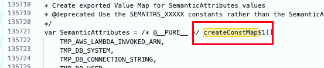
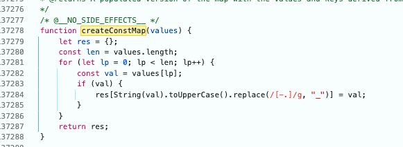

# bundledDev symbol mismatch repro

This package is a standalone Livestore + React app intended to reproduce a `bundledDev` runtime failure where the generated dev output references `createConstMap$1(...)` but only defines `function createConstMap(...)`.



## Dependency chain

The repro uses a trimmed version of the same external package shape as the original app:

- `@livestore/adapter-web`
- `@livestore/react`
- `@livestore/livestore`
- `@opentelemetry/semantic-conventions` through the Livestore / Effect stack

## Run

From the repository root:

```bash
vp install
vp dev packages/bundled-dev-symbol-repro
```

Open:

- `http://127.0.0.1:9010/`

## Expected result

The page fails during startup. In the browser console you should see a runtime error similar to:

```text
ReferenceError: createConstMap$1 is not defined
```

## Optional static verification

With the dev server still running:

```bash
node packages/bundled-dev-symbol-repro/scripts/verifyServed.mjs
```

Expected output:

```text
Found mismatch in http://127.0.0.1:9010/assets/...
Pattern present: createConstMap$1(
Definition present: function createConstMap(
```
